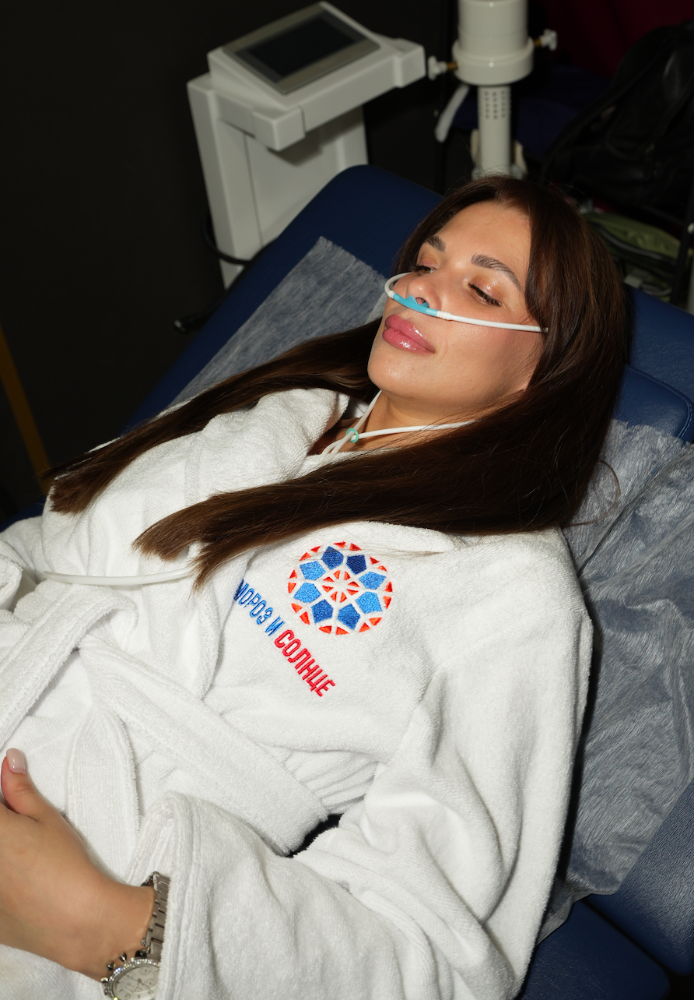

# ВОДОРОДОТЕРАПИЯ

### Цель обучения

Администратор должен уметь простыми словами объяснить посетителю принцип действия водородотерапии, рассказать, как проходит посещение, ответить на основные вопросы и предложить подходящий формат — 30 минут, 60 минут или комплексную программу.

## 1. Что такое водородотерапия

Водородотерапия в центре — это спокойная ингаляционная процедура. Аппарат генерирует газовую смесь, содержащую молекулярный водород `H₂`, а посетитель дышит ею через индивидуальную назальную канюлю.

Посетитель располагается сидя или лежа, дышит как обычно и может отдыхать. Переодеваться не нужно. В центре предусмотрены форматы 30 и 60 минут.

### Объяснение посетителю за 20 секунд

> Водородотерапия — это спокойная ингаляция молекулярного водорода через мягкую назальную канюлю. Молекулярный водород обладает антиоксидантными свойствами и помогает организму противостоять воздействию наиболее активных свободных радикалов. Вы удобно располагаетесь и дышите как обычно в течение 30 или 60 минут. Переодеваться и специально готовиться не нужно.

### Как выглядит процедура

Подпись под фотографией:

> Во время водородотерапии посетитель спокойно располагается и дышит через мягкую назальную канюлю. Переодеваться и выполнять специальные дыхательные упражнения не нужно.

## 2. Принцип действия

В процессе жизнедеятельности в организме образуются свободные радикалы — активные молекулы, которые участвуют в нормальных биологических процессах. Но при стрессе, недосыпе, высоких физических нагрузках и других неблагоприятных факторах их может становиться слишком много. Такое состояние называют окислительным стрессом.

Молекулярный водород изучается как антиоксидант. Его антиоксидантные свойства связывают со способностью взаимодействовать с наиболее агрессивными активными формами кислорода, в том числе со свободными радикалами, и тем самым помогать снижать их повреждающее воздействие на клетки.

Молекула водорода очень мала, поэтому способна быстро распространяться в организме. При ингаляции водород поступает через дыхательные пути.

### Как объяснить посетителю простыми словами

> В организме постоянно образуются свободные радикалы. Когда их становится слишком много из-за стресса, недосыпа или нагрузок, возникает окислительный стресс. Молекулярный водород обладает антиоксидантными свойствами и помогает нейтрализовать наиболее активные свободные радикалы. Поэтому водородотерапию используют как поддержку восстановительных процессов организма.

### Важная граница

Администратор не говорит, что водород «выводит все токсины», «полностью очищает организм» или гарантированно устраняет окислительный стресс. Корректная формулировка — антиоксидантная поддержка организма и помощь в нейтрализации наиболее активных свободных радикалов.

## 3. Что важно понимать администратору

- Это не капельница и не лекарственная ингаляция.
- Это не кислородная маска.
- Процедура не требует переодевания.
- Канюля индивидуальная и устанавливается у входа в ноздри.
- Посетитель дышит спокойно, без специальных дыхательных техник.
- Во время сеанса может не быть ярких ощущений — это нормально.
- Администратор предлагает только утвержденные центром форматы и программы и не назначает лечебный курс.
- Точные параметры смеси и аппарата называются только по паспорту оборудования.

## 4. Как проходит процедура

### При записи

1. Уточнить, выбирает посетитель формат 30 или 60 минут, либо записывается в комплексную программу.
2. Сообщить, что переодеваться и приносить специальную одежду не нужно.
3. Предупредить, что перед первым посещением потребуется заполнить анкету центра.
4. Не обещать конкретное самочувствие или лечебный результат.

### Перед началом

1. Посетитель заполняет утвержденную анкету.
2. При сомнениях или ограничениях администратор не начинает процедуру и действует по утвержденному регламенту центра.
3. Администратор удобно размещает посетителя сидя или лежа.
4. Используется индивидуальная назальная канюля.
5. Посетителю объясняют, что нужно дышать спокойно и сразу сообщить о любом дискомфорте.

### Во время процедуры

1. Посетитель спокойно дышит через нос.
2. Можно отдыхать, слушать музыку или пользоваться телефоном, если это не противоречит правилам центра.
3. Сеанс длится 30 или 60 минут в зависимости от записи.

### После процедуры

1. Администратор спрашивает о самочувствии.
2. Реакция посетителя фиксируется по внутренним правилам.
3. После обратной связи администратор предлагает следующее посещение или подходящую утвержденную программу.

## 5. Что может чувствовать посетитель

Молекулярный водород не должен иметь выраженного запаха или вкуса. Во время сеанса посетитель обычно просто спокойно отдыхает. Некоторые отмечают расслабление, ясность или более свежее состояние после процедуры, другие не чувствуют ярких изменений сразу.

Правильная формулировка:

> Во время процедуры можно практически ничего не чувствовать — это нормально. Ощущения после сеанса индивидуальны, поэтому лучше оценивать собственную реакцию.

## 6. Кому предлагать

Водородотерапию можно предложить посетителю, который говорит:

- «Хочу спокойно полежать и восстановиться»;
- «Много стресса и мало отдыха»;
- «Не высыпаюсь»;
- «После работы тяжелая голова»;
- «Хочу более мягкую процедуру без холода»;
- «Хочу дополнить криокапсулу»;
- «Мне нужен спокойный формат в составе программы».

## 7. Три вопроса перед предложением

1. Вам сейчас больше хочется спокойного отдыха или активной перезагрузки через холод?
2. Удобнее выделить 30 минут или хотите более продолжительный формат на 60 минут?
3. Рассматриваете отдельное посещение или комплекс с криокапсулой и прессотерапией?

## 8. Как предложить процедуру

### Отдельное посещение 30 минут

> Можно начать с водородотерапии на 30 минут. Вы спокойно располагаетесь и дышите через мягкую назальную канюлю, переодеваться не нужно. Это простой формат для знакомства с процедурой. Стоимость разового посещения — 1 500 рублей. Подобрать удобное время?

### Отдельное посещение 60 минут

> Если хочется более продолжительного спокойного сеанса, есть формат 60 минут. Стоимость разового посещения — 2 400 рублей. Давайте посмотрим свободное время?

### В составе FRESH-дня

> Водородотерапия входит во FRESH-день вместе с криокапсулой, прессотерапией и коллагенарием. Это удобно, если хочется попробовать сразу комплекс восстановления за один визит.

## 9. Частые вопросы

### «Что я буду делать?»

> Вы удобно располагаетесь, надеваете мягкую назальную канюлю и спокойно дышите как обычно. Можно просто отдыхать. Переодеваться не нужно.

### «Что я должна почувствовать?»

> Специальных ярких ощущений может не быть. Некоторые посетители отмечают расслабление или более свежее состояние, но реакция индивидуальна.

### «У водорода есть запах или вкус?»

> Выраженного запаха или вкуса быть не должно. Если появляется необычный запах, неприятное ощущение или дискомфорт, сразу скажите администратору.

### «Это кислород?»

> Нет, основа процедуры — молекулярный водород. Точный состав смеси зависит от модели аппарата, поэтому технические параметры мы называем только по паспорту оборудования.

### «Это ингаляция с лекарством?»

> Нет, лекарственные препараты в процедуре не используются.

### «Зачем мне это?»

> Водородотерапию используют для антиоксидантной поддержки организма и уменьшения окислительного стресса. Это спокойный формат без холода и активного воздействия. Его можно попробовать отдельно или добавить к криокапсуле и программе восстановления.

### «Это лечит заболевания?»

> Мы не назначаем лечение. Мы объясняем, как работает водородотерапия: молекулярный водород обладает антиоксидантными свойствами, помогает нейтрализовать наиболее активные свободные радикалы и уменьшать окислительный стресс. Это поддерживающая процедура, а не замена назначенному лечению.

### «Сколько процедур мне нужно?»

> Это зависит от вашей цели, реакции и выбранной программы. Можно начать с одного посещения, оценить свои ощущения и затем выбрать один из утвержденных форматов центра.

## 10. Что администратор не говорит

Запрещенные обещания:

- «Водород вылечит ваше заболевание»;
- «Он полностью убирает окислительный стресс»;
- «Вы сразу почувствуете прилив энергии»;
- «Процедура омолаживает организм на клеточном уровне»;
- «После курса улучшится иммунитет»;
- «У процедуры нет противопоказаний»;
- «Водород подходит абсолютно всем»;
- «Вам обязательно нужен курс из 10 процедур».

Вместо этого:

- «процедуру выбирают как спокойный формат восстановления»;
- «ощущения индивидуальны»;
- «можно начать с одного посещения»;
- «поможем выбрать подходящий утвержденный формат»;
- «при ограничениях сначала уточним возможность процедуры».

## 11. Ограничения и безопасность

Администратор не определяет противопоказания по памяти и не назначает процедуру при сомнениях.

### Процедура не проводится

- при повышенной температуре тела;
- при остром инфекционном или респираторном заболевании;
- при выраженном ухудшении самочувствия, слабости или головокружении до начала процедуры;
- при алкогольном или наркотическом опьянении;
- если посетитель не заполнил анкету или скрыл важную информацию о состоянии здоровья;
- если аппарат, канюля или другие расходники не подготовлены по инструкции;
- если невозможно обеспечить проветривание и требования пожарной безопасности.

### Только после предварительной консультации врача

- беременность и период грудного вскармливания;
- возраст до 18 лет;
- тяжелые или нестабильные заболевания дыхательной системы, включая неконтролируемую астму и выраженную дыхательную недостаточность;
- использование дополнительного кислорода или постоянная кислородотерапия;
- тяжелые хронические заболевания в стадии обострения или декомпенсации;
- недавний инфаркт, инсульт или операция;
- активное лечение онкологического заболевания, включая химиотерапию или лучевую терапию;
- необъяснимые обмороки, выраженное головокружение или судорожные состояния в анамнезе.

Этот перечень является предварительным безопасным фильтром для администратора, а не медицинским заключением. Окончательные противопоказания устанавливаются по руководству производителя конкретного аппарата и утвержденной анкете центра.

### Что говорит администратор

> Перед первым посещением мы просим заполнить короткую анкету. Если у вас есть хронические заболевания, беременность, кислородотерапия, недавняя операция или сейчас повышена температура, сначала нужно уточнить возможность процедуры у врача.

Обязательный порядок:

1. Дать посетителю утвержденную анкету.
2. Проверить, что анкета заполнена полностью.
3. При положительном ответе или сомнении не начинать процедуру и действовать по утвержденному регламенту центра.
4. Использовать только индивидуальную канюлю и расходники по правилам центра.
5. Не менять настройки аппарата без соответствующего допуска и инструкции.
6. Не допускать курения, открытого огня и источников воспламенения рядом с работающим оборудованием.
7. При жалобе или ухудшении самочувствия остановить процедуру и действовать по внутреннему регламенту.

Окончательный список ограничений, правила эксплуатации и очистки утверждаются по паспорту конкретного аппарата.

## 12. Задачи администратора

Администратор:

- выявляет запрос;
- объясняет формат простыми словами;
- предлагает 30 или 60 минут либо комплекс;
- записывает посетителя;
- предупреждает об анкете;
- не назначает лечение и курс;
- собирает обратную связь;
- предлагает следующее посещение или утвержденную программу.

## 13. Проверка знаний

Администратор готов к работе, если может без подсказки:

1. За 20 секунд объяснить водородотерапию.
2. Рассказать, как посетитель дышит и что делает во время сеанса.
3. Назвать форматы 30 и 60 минут и актуальные цены.
4. Объяснить, что ярких ощущений может не быть.
5. Отличить водородотерапию от кислородной и лекарственной ингаляции.
6. Ответить на вопрос «зачем мне это?» без медицинских обещаний.
7. Объяснить, в каких случаях процедура не начинается и применяется внутренний регламент.
8. Закрыть разговор на конкретную запись.
