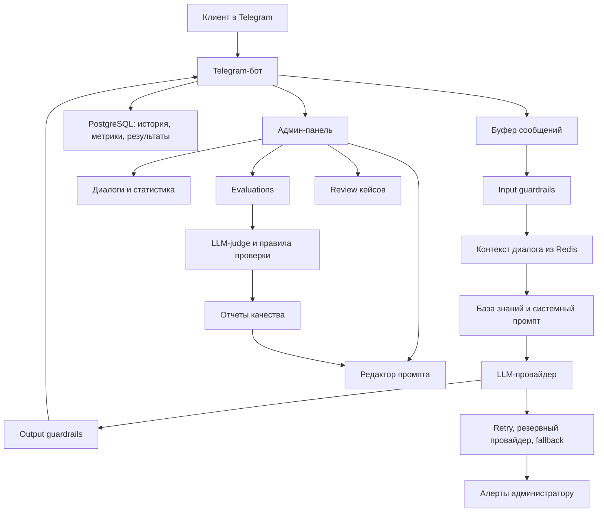

# Архитектура AI-бота «Мороз и Солнце»

Документ показывает, что AI-бот - это не только промпт, а система из нескольких слоев: Telegram-бот, LLM, база знаний, админ-панель, проверки качества, безопасность, отказоустойчивость и эксплуатация.

## Где мы сейчас

**Текущий этап: ступень 3 - Эвалы, то есть проверка качества ответов.**

Уже сделан тестовый контур: бот работает, сервер поднят, админ-панель есть, история диалогов сохраняется, первые проверки качества ответов добавлены.

Это еще не финальный production-контур. Сейчас задача - довести систему до состояния, где ответы можно контролировать, проверять, улучшать и безопасно сопровождать.

## Общая схема системы

## Слои системы

### 1. Telegram-бот

**Статус: сделано.**

Бот принимает сообщения пользователя, показывает typing-индикатор, отправляет ответ, сохраняет историю и работает через Docker на сервере.

Зачем нужен слой: это входная точка для клиентов. Он должен стабильно принимать сообщения, не падать от обычных ошибок и корректно передавать запрос дальше.

### 2. LLM-ядро

**Статус: сделано базово, будет усиливаться.**

LLM-ядро собирает системный промпт, контекст диалога и сообщение пользователя, затем отправляет запрос в модель.

Зачем нужен слой: именно здесь формируется ответ бота. Но качество ответа зависит не только от промпта, а еще от контекста, базы знаний, ограничений, тестов и fallback-логики.

### 3. База знаний и промпт

**Статус: частично сделано.**

Системный промпт уже подготовлен и усилен до версии v1.2. Создан черновой файл с услугами и ценами `services_prices.md`.

Что еще нужно: получить от клиента полный актуальный прайс и уточненные материалы по услугам, противопоказаниям, сертификатам, записи и частым вопросам.

Зачем нужен слой: без точной базы знаний бот может отвечать общо или ошибаться в деталях. Для бизнеса особенно важны цены, ограничения по услугам и правильная передача к администратору.

### 4. Хранилища: Redis и PostgreSQL

**Статус: сделано базово.**

Redis хранит короткий контекст диалога. PostgreSQL хранит историю сообщений, данные админки, метрики и результаты проверок.

Зачем нужен слой: бот должен помнить последние сообщения, а команда должна видеть историю, анализировать качество и восстанавливать картину общения.

### 5. Админ-панель

**Статус: сделано как внутренний тестовый инструмент.**

В админке уже есть диалоги, статистика, редактор промпта, управление ботом, логи, evaluations и review кейсов.

Зачем нужен слой: без админки AI-бот превращается в черный ящик. Админ-панель позволяет видеть, что происходит, управлять поведением и не зависеть от ручного просмотра Telegram.

### 6. Evaluations - проверки качества ответов

**Статус: текущий этап, сделано ядро.**

Добавлены тест-кейсы, eval-runner, результаты прогонов, LLM-judge и клиентская страница для ревью кейсов. Первый прогон: 25 из 25 тестов прошли.

Что еще нужно: расширить набор тестов до реальных сценариев клиента, добавить ожидаемое поведение, критерии оценки и спорные кейсы.

Зачем нужен слой: AI-ответы нельзя считать стабильными только потому, что один раз бот ответил хорошо. Нужно проверять типовые вопросы, сложные вопросы, ошибки, неизвестные услуги, медицинские границы и попытки сломать поведение.

### 7. Буфер сообщений

**Статус: следующий этап.**

Буфер будет склеивать быстрые сообщения пользователя в один запрос.

Пример: человек пишет не одно полное сообщение, а серию: «Здравствуйте», «хочу в солярий», «а сколько стоит», «и можно сегодня?». Без буфера бот может ответить на каждую фразу отдельно. С буфером он дождется короткой паузы и ответит на весь смысл сразу.

Зачем нужен слой: ответы становятся естественнее, дешевле по токенам и меньше раздражают пользователя.

### 8. Guardrails - безопасность поведения LLM

**Статус: запланировано.**

Guardrails - это слой защитных правил до и после LLM.

Что проверяется:
- попытки вытащить системный промпт;
- jailbreak-запросы;
- слишком длинные или подозрительные сообщения;
- опасные медицинские формулировки;
- выдуманные цены, услуги и свободные слоты;
- утечки внутренних инструкций.

Зачем нужен слой: модель должна не только отвечать красиво, но и соблюдать границы: не придумывать, не раскрывать внутренние инструкции, не давать опасных обещаний и корректно отправлять к администратору.

### 9. Надежность LLM

**Статус: запланировано.**

Этот слой включает retry, резервного провайдера, fallback-сообщения и алерты.

Зачем нужен слой: LLM-провайдер может быть недоступен, отвечать медленно, вернуть ошибку или закончить лимиты. Production-система должна не молча ломаться, а корректно обработать сбой и сообщить администратору.

### 10. Интеграция с записью

**Статус: после тестового запуска.**

YCLIENTS API и автоматическое создание, перенос или отмена записи вынесены на отдельный этап.

Зачем так: сначала нужно проверить пользу базового бота и качество ответов. Потом уже подключать действия, которые влияют на реальные записи клиентов.

### 11. Production-ready слой

**Статус: впереди.**

Финальный production-контур включает HTTPS, закрытые Redis/PostgreSQL, firewall, SSH по ключам, healthchecks, ротацию логов, бэкапы, восстановление из бэкапа, документацию, инструктаж и правила обработки персональных данных.

Зачем нужен слой: это делает систему не просто работающей, а сопровождаемой, безопасной и устойчивой.

## Лестница работ

| Этап | Название | Статус | Что дает |
|---|---|---|---|
| 1 | Прототип | Сделано | Бот отвечает в Telegram через LLM |
| 2 | Админ-панель | Сделано | Видны диалоги, статистика, промпт, логи, управление ботом |
| 3 | Evaluations | Сейчас здесь | Проверяем качество ответов тест-кейсами |
| 4 | Буфер сообщений | Следующий этап | Бот склеивает быстрые сообщения и отвечает естественнее |
| 5 | Guardrails | Запланировано | Защита от jailbreak, утечек, опасных и выдуманных ответов |
| 6 | Надежность LLM | Запланировано | Retry, резерв, fallback, алерты |
| 7 | Интеграции и запись | После тестового запуска | YCLIENTS, запись, перенос, отмена, fallback к администратору |
| 8 | Production-ready | Финальный этап | Безопасность, бэкапы, мониторинг, документация, сдача |

## Что уже можно показывать как прогресс

- Бот уже собран и работает как тестовый контур.
- Серверный деплой уже выполнен.
- Админ-панель уже создана.
- Диалоги, статистика, управление ботом и логи уже есть.
- Системный промпт уже не черновой, а усилен несколькими итерациями.
- Добавлены первые eval-тесты качества.
- Первый eval-прогон прошел успешно: 25/25.
- Есть отдельная страница для клиентского ревью тест-кейсов.

## Что важно донести

Промпт - это только один элемент системы. Для устойчивого AI-бота нужны еще база знаний, тесты, админ-контроль, защита поведения, обработка ошибок, хранение истории, мониторинг и правила эксплуатации.

Сейчас мы уже прошли этап "бот просто отвечает" и находимся на этапе "бот должен отвечать проверяемо, управляемо и предсказуемо".

Финальная цель - не просто чат-бот, а контролируемый AI-инструмент для бизнеса, где можно видеть ответы, проверять качество, быстро вносить правки и безопасно сопровождать систему после запуска.
